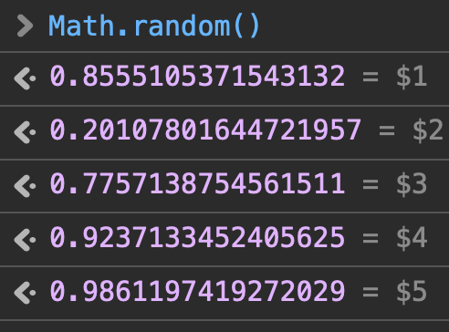

# How to use PoC

1st: go to your Safari and open devtool, try to get some random values:



2nd: go to `index.py` and change the:

```python
sequence = [
0.9065404032451221,
0.1705210652689907,
0.08764227924002821,
0.29180443582608384,
]
```

into your random values, for example:

```python
sequence = [
 0.8555105371543132,
 0.20107801644721957,
 0.7757138754561511,
 0.9237133452405625,
 0.9861197419272029,
]
```

3rd: run `index.py` file (please install `z3` first):
```sh
python3 index.py
```
